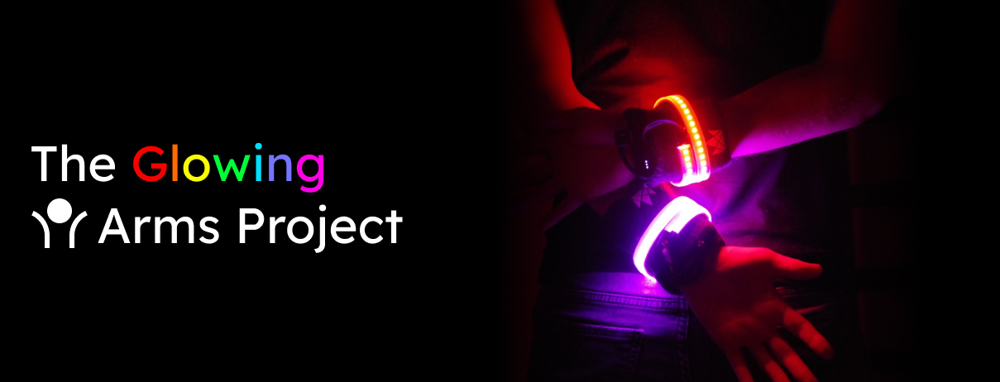

Build your own LED wristbands for dancing. Controllable via iOS &amp; Android apps. No coding is required.

Want to support the development and stay updated?

 

## Features

- controllable via Bluetooth using the Govee Home [iOS](https://apps.apple.com/us/app/govee-home/id1395696823) and [Android](https://play.google.com/store/apps/details?id=com.govee.home&hl=en) apps
- "Music Mode", reacting to music using the integrated microphone
- "Custom Color Mode", let the LEDs glow in whatever color you like
- and more modes, using the app

## How to build it
Watch this video to learn how you can build the LED wristbands yourself:

[How to build LED wristbands for dancing - no coding required!](https://www.youtube.com/watch?v=rtVQ7AlgY54)

