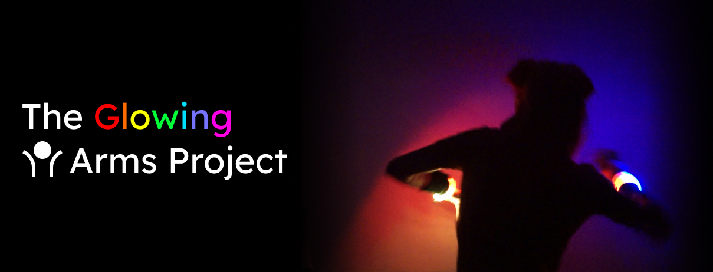

Build your own LED arm bands for dancing. Controllable via iOS &amp; Android apps. No programming required.

Want to support the development and stay updated?

 

[Click here](#photos) to see photos of the bike.

## Features

- controllable via Bluetooth using the Govee Home [iOS](https://apps.apple.com/us/app/govee-home/id1395696823) and [Android](https://play.google.com/store/apps/details?id=com.govee.home&hl=en) apps
- "Music Mode", reacting to music using the integrated microphone
- "Custom Color Mode", let the LEDs glow in whatever color you like
- and more modes, using the app

## Requirements

### Hardware

- 2x Govee DreamColor LED strips (2m)
- 2x The Friendly Swede Wristband (L)
- 2x AINOPE Power Bank (5000mAh, 0.5 inch, 2020 version)
- 2x Angled USB to USB cable
- 1x WS2812B LED strips (1m, 144 LEDs/m, black, with Ip67)
- Hook-and-loop fastener (min 30 cm, black)
- isolation tape
- soldering iron, solder
- cables, to connect LED strips, USB power cables and microcontroller
- hot glue gun
- very stable yarn
- a very strong glue for the LED strip cover

## How to build your glowing LED wristbands

### Electronics overview

### Hardware

- crack the 2 microcontroller cases of the Dreamcolor LED strips open, remove the screws inside and cut the cables off or desolder them (450 degrees celcius)

- solder all the cables to the right pins between the LED strip, microcontroller and the USB cable. When you are done - you can connect the USB cable to the external battery and the LED strips should start to glow! To be safe: add some hot glue to the soldering connections on the microcontroller and LED strips, as well as on the other end of the LED strip (to make it more water resistant)

- fix the microcontroller to the external battery using isolation tape

- insert the battery pack with the microcontroller carefully into the wristband. Then add the Hook-and-loop fastener to the LED strip and wristband (loop side on the wristband) and fix it with some very strong glue and even better some strong yarn

Congrats! You are done!

## Photos

